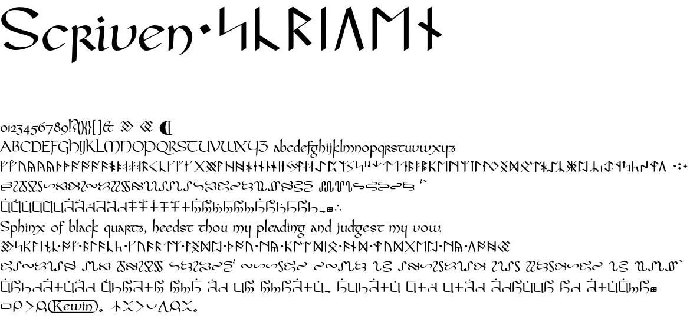

# Scriven
Pseudo-mediæval style font with support for constructed languages.

The Latin minuscule is mostly based on Carolingian with some Insular touches. It is not meant to be representative of any one real historical script. It was particularly influenced by the design of Pfeffer Mediæval. The style of the other scripts tries to look consistent with the Latin so that it looks like one scribe wrote them with one pen.

There is currently some support for Latin, Runic (influenced by the style in the Ultima games), Gargish (from Ultima), Ophidian (from Ultima), Cirth (from the works of J. R. R. Tolkien), and sitelen pona (logographic script for the constructed language toki pona)

I may add support for other constructed scripts outside of Ultima in future. Tengwar is a possibility although it's much more complex than Cirth.  Other video game related scripts in Under-Conscript like D'ni and Standard Galactic or other constructed scripts like Aurebesh, pi'Qad, or Shavian are possibilities.

## In development

This font is in development and will change.  Do not count on it to retain the same metrics, coverage, encoding in the private use area, or OpenType features in future updates.  If you encounter issues please provide clear examples including the specific text, font features you have enabled, and the software you are using.

## Latin

Scriven includes support for basic Latin script, plus several combining accents and supplementary characters.  It should work for English, French, Spanish, and German at least.  It includes support for some historical characters including long/medial s, r rotunda, thorn(using a shape appropriate for historical English rather than modern Icelandic), and wynn.

### Features

`calt` Q and x have swashes by default and the calt feature prevents them from colliding with descenders.

`hist` Changes s to long s when not followed by another lower case letter.

`liga` Presentation ligatures for sequences involving f, long-s, l, t, g, and !

`ss01` Applies tehetar markings to Latin vowels.

`ss02` Dotted decorative forms for Latin capitals.

`ss06` Convert r to r-rotunda after letters that have a right facing bow.

## Runic

Most of the Unicode Runic block is covered.  The design was particularly influenced by the runes in the Ultima games.

### Features

`ss04` Convert Latin script to Sosarian runes from the Ultima games.  It automatically converts the digraphs 'EE', 'EA', 'ST', 'TH', and 'NG' to single runes.  To write words where this should not happen, place an apostrophe or a zero width non joiner in between the letters. For example, write `Moonglow` as `Moon'glow` or `reengaging` as `re'en'gaging`.

## Gargish

The entire UCSUR block for the Gargish script from Ultima is supported.

### Features

`ss05` Convert Latin script to Gargish.  Gargish letters represented as digraphs are automatically converted.  If you need to represent `g` then `l` instead of the single `gl` letter, separate them with an apostrophe or zero width joiner.

## Ophidian
The entire UCSUR block for the Ophidian script from Ultima is supported however the specification is ambiguous.  Scriven interprets combining pairs as joining left to right or bottom to top as appropriate.  There are also additional characters in the unused portion of the block for `OPHIDIAN COMMA` at `E5FE`, `OPHIDIAN FULL STOP` at `E5FF`, `OPHIDIAN EARTH SERPENT` at `E5FA`, `OPHIDIAN CHAOS SERPENT` at `E5FB`, `OPHIDIAN ORDER SERPENT` at `E5FC`.  The serpent symbols can be combined using `ZERO WIDTH JOINER` for instance `E5FB 2005 E5FA 2005 E5FC` will give the Ophidian symbol for balance between Chaos and Order.

### Features

`rlig` Combining pairs and ZWJ sequences use the required ligatures feature.

## Cirth

The entire UCSUR block for the Cirth script from the legendarium of J.R.R. Tolkien is supported.
